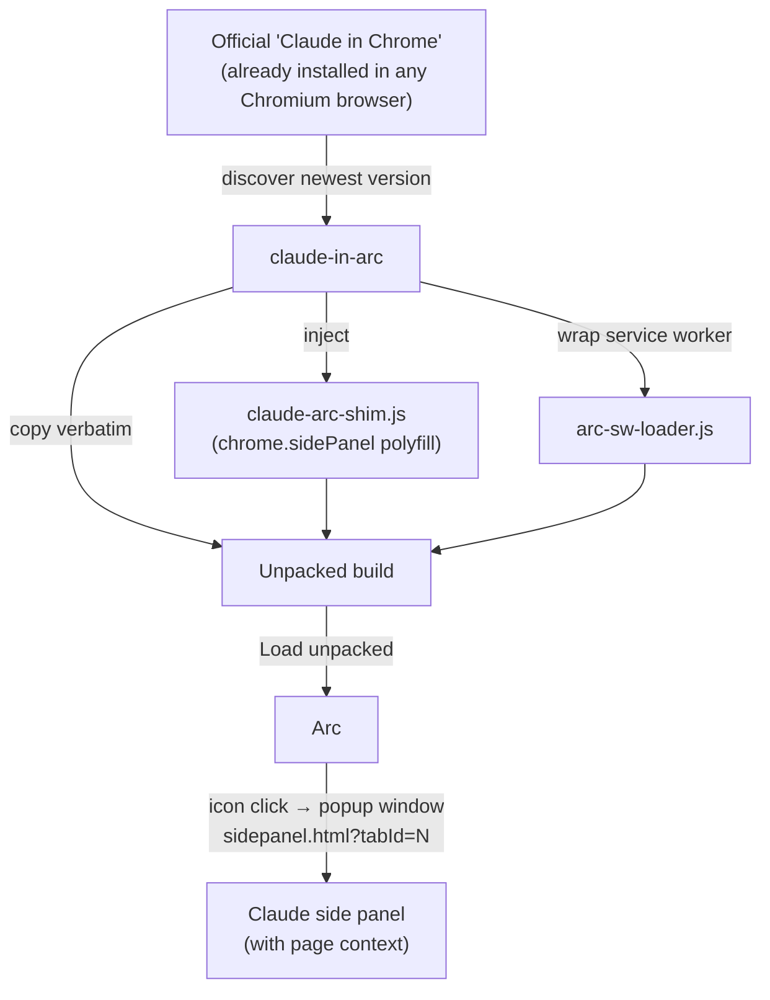

<div align="center">

# Claude in Arc

### Claude's side panel, now at home in Arc.

Run the official "Claude in Chrome" extension in Arc — real side‑panel chat, full page context. No more *"This browser is not supported. Use Google Chrome, Microsoft Edge, or Brave."*

[](LICENSE)
[](#requirements)
[](#requirements)
[](tests)
[](docs/SECURITY.md)
[](https://github.com/Zu9zwan9/claude-in-arc/stargazers)

**Unofficial · community‑built · not affiliated with or endorsed by Anthropic or The Browser Company.**


<sub>↑ Replace `docs/demo.gif` with a short screen recording: click the Claude icon in Arc → popup opens → ask about the current page.</sub>

</div>

## Install in one line

```bash
curl -fsSL https://raw.githubusercontent.com/Zu9zwan9/claude-in-arc/main/bootstrap.sh | bash
```

That detects macOS + Arc + your installed Claude extension, fetches the tool into `~/.claude-in-arc`, verifies the extension is genuine, builds the Arc‑compatible copy, and prints the one remaining click. **macOS only. Zero dependencies** (system `python3`). No `sudo`, ever.

**Prefer to read before you run** (recommended for any `curl | bash`):

```bash
curl -fsSLO https://raw.githubusercontent.com/Zu9zwan9/claude-in-arc/main/bootstrap.sh
less bootstrap.sh          # inspect it
bash bootstrap.sh          # then run
```

**Or clone first:**

```bash
git clone https://github.com/Zu9zwan9/claude-in-arc.git
cd claude-in-arc
./install.sh
```

---

## TL;DR

There are **three separate problems** people conflate when they say "Claude doesn't work in Arc." Two are fixable on your machine. One isn't, and this project is honest about that.

| # | Problem | Cause | Fixable locally? | Fixed here? |
|---|---------|-------|:---------------:|:-----------:|
| 1 | Clicking the Claude icon does nothing; extension reports "unsupported browser". | Arc doesn't implement Chrome's `chrome.sidePanel` API. | ✅ | ✅ |
| 2 | Claude Desktop can't connect to the extension. | Native‑messaging host manifest is only auto‑installed for Chrome/Edge. | ✅ | ✅ (best‑effort `link`) |
| 3 | Claude Code `/chrome` **browser automation** can't find the extension. | Server‑side feature flag `chrome_ext_bridge_enabled` returns `false` for non‑Chrome browsers. | ❌ | ❌ (documented, not faked) |

This tool fixes **#1 and #2** and refuses to overpromise **#3**. See [the limitation](#the-honest-limitation-claude-code-chrome-automation).

## Why this is different from the other patches

Several community repos take a screenshot in time and break on the next extension update. This one is engineered to be the **canonical, durable** fix.

| | **claude‑in‑arc** (this) | timeoio/claude‑for‑arc | chxsong/Claude‑in‑Arc | Dylanyz/claude‑arc‑patch | stolot0mt0m/native‑messaging |
|---|:---:|:---:|:---:|:---:|:---:|
| Patches **your own freshly‑installed** extension (never goes stale) | ✅ | ❓ | ❌ (deep visual injection) | ❌ (bundles a stale copy) | n/a |
| Side‑panel chat works in Arc | ✅ | ❓ | ⚠️ | ✅ | ❌ |
| **Page context** preserved (`?tabId=`) | ✅ | ❓ | ⚠️ | ✅ | ❌ |
| **No‑op on real Chrome/Brave/Edge** (one universal build) | ✅ | ❓ | ❌ | ❌ | n/a |
| **Preserves official extension id** (native messaging stays valid) | ✅ | ❓ | ❌ | ❌ | n/a |
| **Cryptographic authenticity check** before patching | ✅ | ❌ | ❌ | ❌ | ❌ |
| **One‑line `curl \| bash`** install + auto‑open + rollback | ✅ | ❓ | ❌ | ❌ | partial |
| Native‑messaging host setup | ✅ | ❓ | ❌ | partial | ✅ |
| Honest about `/chrome` server‑flag limitation | ✅ | ❓ | ❌ | ❌ | ✅ |
| Zero dependencies / single CLI / tested | ✅ (19) | ❓ | ❌ | ❌ | shell |

❓ = not documented / repo empty at time of writing. Full breakdown and notes: [`docs/COMPARISON.md`](docs/COMPARISON.md).

The core insight nobody else productized: the extension's own panel URL **already encodes the originating tab** (`sidepanel.html?tabId=<id>`), so re‑hosting it as a popup window keeps full page context — no reverse‑engineering of minified code required.

## How the fix works

The extension's service worker does, in essence:

```js
async function openPanel(tabId) {
  if (!chrome.sidePanel) return reportUnsupportedBrowser();   // ← Arc dies here
  chrome.sidePanel.setOptions({ tabId, path: `sidepanel.html?tabId=${tabId}`, enabled: true });
  chrome.sidePanel.open({ tabId });
}
```

`claude-in-arc` injects a **`chrome.sidePanel` polyfill** that opens the panel as a popup window. It is a **no‑op when the real API exists**, so the same build runs unchanged on Chrome/Brave/Edge. Anthropic's code is copied verbatim — the only additions are a shim file, a two‑line service‑worker loader, and one `<script>` tag in two HTML pages.



## The one remaining click

Loading an unpacked extension is the single step Chromium requires a human to do
(no tool can do it silently — that's a security boundary, by design). The
installer does everything else and even opens the page and reveals the folder
for you. All that's left:

1. In Arc, go to `arc://extensions` (the installer opens this for you).
2. Turn on **Developer mode** (toggle, top‑right).
3. Click **Load unpacked** → choose the folder it reveals:
   `~/Library/Application Support/ClaudeInArc/Claude-in-Arc-Extension`

Then click the Claude toolbar icon (or press `Cmd+E`). The panel opens as a popup
window with full page context. 🎉

> **Two Claude entries?** The default build keeps the **official extension id**, so
> Arc loads only one copy. Either remove the Store copy, **or** re‑run with
> `--new-id` to keep both. `claude-in-arc doctor` detects this for you.

## Commands & flags

```bash
claude-in-arc install      # build + verify + link + open Arc + print the last click (default)
claude-in-arc doctor       # diagnose: Arc, extension, two-Claude conflict, load state, native messaging
claude-in-arc build        # only (re)build the patched extension
claude-in-arc link         # mirror the Claude native-messaging host into Arc
claude-in-arc reveal       # open the build folder in Finder
claude-in-arc uninstall    # full rollback: remove build, restore backups, clear state
```

Flags: `-v/--verbose`, `-q/--quiet`, `--dry-run` (preview), `--new-id` (coexist with the Store copy), `--source PATH` (patch a specific unpacked extension), `--no-open` (don't launch Arc/Finder), `--no-link` (skip native messaging), `--allow-unverified` (skip the authenticity check — not recommended).

## The honest limitation: Claude Code `/chrome` automation

Browser automation via Claude Code's `/chrome` command communicates through a remote bridge (`wss://bridge.claudeusercontent.com`) that the extension only opens when a **server‑side** feature flag (`chrome_ext_bridge_enabled`) returns `true` — and it returns `false` for non‑Chrome browsers. **No local script can change a server flag**, so this tool does not pretend to fix it. The side‑panel chat with page context — what this tool enables — does not depend on that bridge.

We've written this up as a constructive bug report / feature request to Anthropic: see [`docs/anthropic-bug-report.md`](docs/anthropic-bug-report.md), referencing [claude‑code#34364](https://github.com/anthropics/claude-code/issues/34364) and [#18075](https://github.com/anthropics/claude-code/issues/18075). If you want this fixed at the source, 👍 those issues.

## Security

This tool runs on your machine and touches a browser extension, so it's built to
be trustworthy and is fully documented in [`docs/SECURITY.md`](docs/SECURITY.md):

- **No `sudo`, least privilege.** Writes only inside your home/Library.
- **Cryptographic authenticity check.** The source extension's public `key` must
  hash to the official id (`fcoeoabgfenejglbffodgkkbkcdhcgfn`) or the tool aborts.
- **Zero new permissions.** The patched build keeps Anthropic's verbatim code and
  permissions; our only additions are a no‑op `chrome.sidePanel` shim, a two‑line
  loader, and one `<script>` tag per page.
- **Backups + full rollback.** Any overwritten file is backed up; `uninstall`
  restores it and removes everything we added.
- **No telemetry, no secrets, no network calls** in the tool (only `bootstrap.sh`
  fetches the repo, and it documents an inspect‑first alternative to `curl | bash`).

## Requirements

- macOS
- The system `python3` (ships with the Xcode Command Line Tools: `xcode-select --install`)
- The official **Claude in Chrome** extension installed in any Chromium browser ([Web Store](https://chromewebstore.google.com/detail/claude/fcoeoabgfenejglbffodgkkbkcdhcgfn))

## Updating

When the official extension updates in your browser, re‑run `claude-in-arc install` to rebuild from the new version, then hit **Reload** on `arc://extensions`.

## Development

```bash
python3 -m unittest discover -s tests -v
```

The patch engine and safety logic are covered by a synthetic‑extension test suite (22 tests): service‑worker repointing, shim ordering, page injection, idempotency, id preservation, `--new-id`, **cryptographic authenticity verification**, **path‑safety guards**, **backup creation**, **uninstall rollback**, and **CLI layout/identity**.

## Contributing

PRs very welcome — especially:

- Other Chromium browsers that need the same patch (Vivaldi, Brave Beta, Helium, …)
- Windows and Linux support for the CLI
- A polished demo GIF

See [STRATEGY.md](STRATEGY.md) for where this project is headed.

## Support this project

`claude-in-arc` is free and MIT‑licensed, and the core will **always** stay that way — nothing is gated. If it saved you time, you can support continued maintenance:

- ❤️ [GitHub Sponsors](https://github.com/sponsors/Zu9zwan9)
- ☕ [](https://www.buymeacoffee.com/mbard)
- ⭐ Star the repo and link it in Arc threads — visibility helps more than money.

<!--
  Official Buy Me a Coffee embed (slug: mbard). GitHub Markdown does NOT execute
  <script> tags, so the clickable badge above is what actually renders here. This
  snippet is preserved for any future HTML/GitHub Pages surface where the live
  widget can run:

  <script type="text/javascript" src="https://cdnjs.buymeacoffee.com/1.0.0/button.prod.min.js" data-name="bmc-button" data-slug="mbard" data-color="#FFDD00" data-emoji="" data-font="Cookie" data-text="Buy me a coffee" data-outline-color="#000000" data-font-color="#000000" data-coffee-color="#ffffff"></script>
-->

## Credits & prior art

Builds on the community's reverse‑engineering, in particular [stolot0mt0m/claude-chromium-native-messaging](https://github.com/stolot0mt0m/claude-chromium-native-messaging) (native‑messaging analysis) and [Dylanyz/claude-arc-patch](https://github.com/Dylanyz/claude-arc-patch) (the popup‑window approach). What's new here: patching your *installed* extension instead of a bundled copy, a clean universal `chrome.sidePanel` polyfill, id preservation, a tested patch engine, and a single dependency‑free CLI.

## Disclaimer

Unofficial, community‑built workaround. The official extension targets Google Chrome. Anthropic may change its implementation at any time. Use at your own risk. **Not affiliated with, sponsored by, or endorsed by Anthropic or The Browser Company.** "Claude" and "Arc" are trademarks of their respective owners; they're used here only to describe what this tool interoperates with (nominative fair use).

## License

MIT — see [LICENSE](LICENSE).
