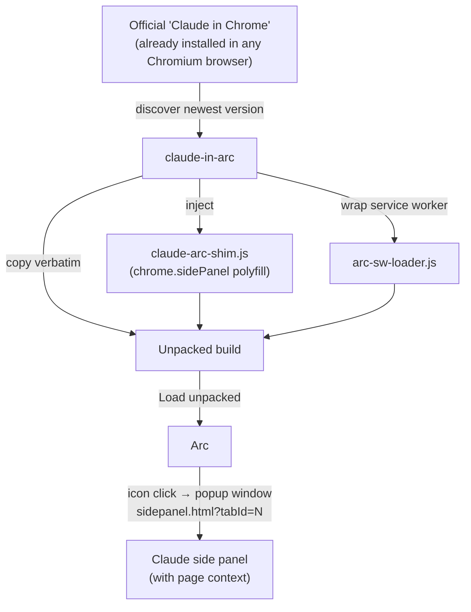

<div align="center">

# Claude in Arc

### Claude's side panel, now at home in Arc.

Run the official "Claude in Chrome" extension in Arc — real side‑panel chat, full page context. No more *"This browser is not supported. Use Google Chrome, Microsoft Edge, or Brave."*

[](LICENSE)
[](#requirements)
[](#requirements)
[](tests)
[](docs/SECURITY.md)
[](https://github.com/Zu9zwan9/claude-in-arc/stargazers)

**Unofficial · community‑built · not affiliated with or endorsed by Anthropic or The Browser Company.**


<sub>↑ Replace `docs/demo.gif` with a short screen recording: click the Claude icon in Arc → popup opens → ask about the current page.</sub>

</div>

## Quick Start

Everything you need to get Claude's side panel working in Arc. For a step-by-step verification checklist when something goes wrong, see **[docs/WALKTHROUGH.md](docs/WALKTHROUGH.md)**.

### Prerequisites

Before you run the installer, make sure you have:

1. **macOS** — this tool supports macOS only.
2. **Arc** — [arc.net](https://arc.net). The installer works without Arc installed, but you need it to load the extension.
3. **System Python 3** — ships with macOS or the Xcode Command Line Tools (`xcode-select --install`).
4. **The official Claude in Chrome extension** — install it from the [Chrome Web Store](https://chromewebstore.google.com/detail/claude/fcoeoabgfenejglbffodgkkbkcdhcgfn) in **Arc or any Chromium browser** (Chrome, Brave, Edge, …). The tool auto-detects the newest copy on your Mac and verifies it is genuine before patching.

No `sudo`, no Homebrew, no Node — just system `python3`.

### Recommended: one-line install

```bash
curl -fsSL https://raw.githubusercontent.com/Zu9zwan9/claude-in-arc/main/bootstrap.sh | bash
```

This downloads the tool into `~/.claude-in-arc`, puts `claude-in-arc` on your PATH, finds your installed Claude extension, cryptographically verifies it, builds an Arc-compatible copy, links Claude Desktop native messaging (if available), opens Arc's extensions page, and reveals the build folder in Finder.

**Prefer to read before you run** (recommended for any `curl | bash`):

```bash
curl -fsSLO https://raw.githubusercontent.com/Zu9zwan9/claude-in-arc/main/bootstrap.sh
less bootstrap.sh          # inspect it
bash bootstrap.sh          # then run
```

### Alternative: clone and install

```bash
git clone https://github.com/Zu9zwan9/claude-in-arc.git
cd claude-in-arc
./install.sh
```

This does the same thing as the one-liner, but keeps a full git checkout in the repo folder instead of `~/.claude-in-arc`.

### Step-by-step Arc setup (the one manual step)

Chromium requires a human to load an unpacked extension — no tool can bypass this security boundary. The installer does everything else; you only need about fifteen seconds in Arc:

1. Open **`arc://extensions`** in Arc (the installer opens this for you).
2. Turn on **Developer mode** — toggle in the top-right corner.
3. If you see a **Claude** entry from the Chrome Web Store, click **Remove** on it. The default build keeps Anthropic's official extension id, so Arc can only run one copy at a time. Keeping the Store copy is the #1 reason toolbar clicks do nothing.
4. Click **Load unpacked** and choose this folder (also revealed in Finder):

   ```
   ~/Library/Application Support/ClaudeInArc/Claude-in-Arc-Extension
   ```

5. Confirm the extension card shows:
   - **Source:** Load unpacked
   - **Service worker:** `arc-sw-loader.js` (click "Service worker" — the console should have no red import errors)

6. Run a quick check from Terminal:

   ```bash
   claude-in-arc verify
   ```

   All checks should pass. If any are red, see [Troubleshooting](#troubleshooting) below or the full checklist in [docs/WALKTHROUGH.md](docs/WALKTHROUGH.md).

> **Two Claude entries?** Either remove the Store copy (recommended — keeps Claude Desktop integration), or re-run with `claude-in-arc install --new-id` to keep both under separate ids. Run `claude-in-arc doctor` to detect this automatically.

### Daily use

Once loaded, Claude works like it does in Chrome:

1. Navigate to any normal webpage (not `arc://` or `chrome://` internal pages).
2. Click the **Claude toolbar icon** or press **`⌘E`** (Cmd+E).
3. A narrow **side window** opens on the right with Claude's panel UI — the URL includes `sidepanel.html?tabId=…`, so Claude sees the **current page context**.

   **Arc limitation:** Arc does not implement Chrome's built-in `chrome.sidePanel`. The shim uses **split-panel mode** by default on Arc: page content narrows left while a docked popup shows Claude on the right (no blocked iframe). **In-page sidebar mode does not work on Arc** — Arc blocks `chrome-extension://` iframes in pages. On Chrome/Brave you can opt in:

   ```bash
   claude-in-arc config --panel-mode sidebar   # Chrome/Brave only; then Reload
   claude-in-arc config --panel-mode popup      # Arc: popup-only, no page margin
   ```

   See **[docs/ARC_LIMITATIONS.md](docs/ARC_LIMITATIONS.md)** for split view, native sidebar, iframe blocking, and mode tradeoffs. **macOS Dynamic Island** is not available to browser extensions; see **[docs/DYNAMIC_ISLAND.md](docs/DYNAMIC_ISLAND.md)** for why and for the Phase 2 menu-bar / notch HUD companion (`native/` scaffold).
4. Ask Claude about the page, highlight text, or use the panel normally.

When Anthropic updates the official extension, re-run `claude-in-arc install` and click **Reload** on the unpacked entry in `arc://extensions`.

### Troubleshooting

**Symptom: clicking the Claude icon does nothing**

This almost always means Arc is still running the unpatched Store copy, or an old build from before v1.2.1. Arc exposes a broken `chrome.sidePanel` stub that silently swallows clicks.

1. Run **`claude-in-arc verify`** — it prints expected vs. actual for every check.
2. On `arc://extensions`, **Remove** the Store "Claude" entry. Keep only the **Load unpacked** copy pointing at `ClaudeInArc/Claude-in-Arc-Extension`.
3. Update and rebuild:
   ```bash
   cd ~/.claude-in-arc && git pull    # if you used the one-liner
   claude-in-arc install
   ```
4. In Arc, click **Reload** on the unpacked Claude extension.
5. Open the **service worker console** (`arc://extensions` → Claude → Service worker → Inspect). Look for import errors in `claude-arc-shim.js` or `arc-sw-loader.js`, or a "Browser not supported" path (means the shim did not load).
6. Try **`⌘E`** as well as the toolbar icon — both should open the panel.

**Symptom: `WebSocket connection to 'wss://bridge.claudeusercontent.com/chrome/…' failed: net::ERR_ADDRESS_INVALID`**

This comes from **Anthropic's official extension**, not from `claude-in-arc`. It is the remote bridge Claude Code's `/chrome` command uses for browser automation. Two different things are called "bridge" in this project:

| Bridge | What it is | Works in Arc? |
|--------|------------|:-------------:|
| **Remote bridge** (`wss://bridge.claudeusercontent.com`) | Anthropic server for Claude Code `/chrome` MCP tools | ❌ |
| **Sidebar bridge** (`claude-arc-sidebar-bridge.html`) | Local extension page for in-page sidebar mode (Chrome/Brave only) | N/A on Arc |

On Arc (and other non-Chrome Chromium browsers), Anthropic's server-side flag `chrome_ext_bridge_enabled` evaluates `false`, so the remote bridge WebSocket does not succeed. Chromium reports that as `net::ERR_ADDRESS_INVALID` during the handshake — an expected symptom, not a DNS misconfiguration introduced by this patch.

**What still works in Arc:** side-panel chat with page context, toolbar icon / ⌘E, split-panel mode, Claude Desktop native messaging (after `claude-in-arc link`).

**What does not work in Arc:** Claude Code `/chrome` browser automation (`tabs_context_mcp`, etc.). Use Google Chrome for that workflow, or upvote [anthropics/claude-code#34364](https://github.com/anthropics/claude-code/issues/34364).

Run `claude-in-arc doctor` — the **Claude Code /chrome bridge** section explains this. See also [docs/ARC_LIMITATIONS.md](docs/ARC_LIMITATIONS.md#claude-code-chrome-remote-bridge).

**Other checks**

| Command | When to use |
|---------|-------------|
| `claude-in-arc doctor` | Quick health check |
| `claude-in-arc verify` | Full verbose checklist (same as `doctor --verbose`) |
| `claude-in-arc reveal` | Re-open the build folder in Finder |
| `tail -50 ~/Library/Logs/claude-in-arc/claude-in-arc.log` | Inspect tool logs |

See **[docs/WALKTHROUGH.md](docs/WALKTHROUGH.md)** for the complete forensic checklist, service worker console guidance, and a copy-paste recovery recipe.

### Optional: Claude Desktop integration

Side-panel chat with page context works without this. For Claude Desktop to talk to the browser extension:

1. Enable the browser extension in **Claude Desktop → Settings**.
2. Run `claude-in-arc link`
3. Confirm with `claude-in-arc doctor` — look for "Arc is linked to the native-messaging host."

Skip with `claude-in-arc install --no-link` if you do not use Claude Desktop.

### Optional: uninstall

```bash
claude-in-arc uninstall
```

This removes the patched build, restores any backed-up native-messaging manifest, and clears tool state. Also remove the unpacked Claude entry from `arc://extensions` if it is still listed.

---

## TL;DR

There are **three separate problems** people conflate when they say "Claude doesn't work in Arc." Two are fixable on your machine. One isn't, and this project is honest about that.

| # | Problem | Cause | Fixable locally? | Fixed here? |
|---|---------|-------|:---------------:|:-----------:|
| 1 | Clicking the Claude icon does nothing; extension reports "unsupported browser". | Arc doesn't implement Chrome's `chrome.sidePanel` API. | ✅ | ✅ |
| 2 | Claude Desktop can't connect to the extension. | Native‑messaging host manifest is only auto‑installed for Chrome/Edge. | ✅ | ✅ (best‑effort `link`) |
| 3 | Claude Code `/chrome` **browser automation** can't find the extension. | Server‑side feature flag `chrome_ext_bridge_enabled` returns `false` for non‑Chrome browsers. | ❌ | ❌ (documented, not faked) |

This tool fixes **#1 and #2** and refuses to overpromise **#3**. See [the limitation](#the-honest-limitation-claude-code-chrome-automation).

## Why this is different from the other patches

Several community repos take a screenshot in time and break on the next extension update. This one is engineered to be the **canonical, durable** fix.

| | **claude‑in‑arc** (this) | timeoio/claude‑for‑arc | chxsong/Claude‑in‑Arc | Dylanyz/claude‑arc‑patch | stolot0mt0m/native‑messaging |
|---|:---:|:---:|:---:|:---:|:---:|
| Patches **your own freshly‑installed** extension (never goes stale) | ✅ | ❓ | ❌ (deep visual injection) | ❌ (bundles a stale copy) | n/a |
| Side‑panel chat works in Arc | ✅ | ❓ | ⚠️ | ✅ | ❌ |
| **Page context** preserved (`?tabId=`) | ✅ | ❓ | ⚠️ | ✅ | ❌ |
| **No‑op on real Chrome/Brave/Edge** (one universal build) | ✅ | ❓ | ❌ | ❌ | n/a |
| **Preserves official extension id** (native messaging stays valid) | ✅ | ❓ | ❌ | ❌ | n/a |
| **Cryptographic authenticity check** before patching | ✅ | ❌ | ❌ | ❌ | ❌ |
| **One‑line `curl \| bash`** install + auto‑open + rollback | ✅ | ❓ | ❌ | ❌ | partial |
| Native‑messaging host setup | ✅ | ❓ | ❌ | partial | ✅ |
| Honest about `/chrome` server‑flag limitation | ✅ | ❓ | ❌ | ❌ | ✅ |
| Zero dependencies / single CLI / tested | ✅ (19) | ❓ | ❌ | ❌ | shell |

❓ = not documented / repo empty at time of writing. Full breakdown and notes: [`docs/COMPARISON.md`](docs/COMPARISON.md).

The core insight nobody else productized: the extension's own panel URL **already encodes the originating tab** (`sidepanel.html?tabId=<id>`), so re‑hosting it as a popup window keeps full page context — no reverse‑engineering of minified code required.

## How the fix works

The extension's service worker does, in essence:

```js
async function openPanel(tabId) {
  if (!chrome.sidePanel) return reportUnsupportedBrowser();   // ← Arc dies here
  chrome.sidePanel.setOptions({ tabId, path: `sidepanel.html?tabId=${tabId}`, enabled: true });
  chrome.sidePanel.open({ tabId });
}
```

`claude-in-arc` injects a **`chrome.sidePanel` polyfill** that opens the panel as a popup window. It is a **no‑op when the real API exists**, so the same build runs unchanged on Chrome/Brave/Edge. Anthropic's code is copied verbatim — the only additions are a shim file, a two‑line service‑worker loader, and one `<script>` tag in two HTML pages.



## Commands & flags

```bash
claude-in-arc install      # build + verify + link + open Arc + print the last click (default)
claude-in-arc doctor       # diagnose: Arc, extension, two-Claude conflict, load state, native messaging
claude-in-arc cleanup      # remove leftover Store extension files after arc://extensions Remove
claude-in-arc verify       # verbose walkthrough: expected vs actual for every check (see docs/WALKTHROUGH.md)
claude-in-arc build        # only (re)build the patched extension
claude-in-arc link         # mirror the Claude native-messaging host into Arc
claude-in-arc reveal       # open the build folder in Finder
claude-in-arc uninstall    # full rollback: remove build, restore backups, clear state
```

Flags: `-v/--verbose`, `-q/--quiet`, `--dry-run` (preview), `--new-id` (coexist with the Store copy), `--source PATH` (patch a specific unpacked extension), `--no-open` (don't launch Arc/Finder), `--no-link` (skip native messaging), `--ignore-conflict` (build even when the Store copy is active — not recommended), `--allow-unverified` (skip the authenticity check — not recommended).

## The honest limitation: Claude Code `/chrome` automation

Browser automation via Claude Code's `/chrome` command communicates through a remote bridge (`wss://bridge.claudeusercontent.com`) that the extension only opens when a **server‑side** feature flag (`chrome_ext_bridge_enabled`) returns `true` — and it returns `false` for non‑Chrome browsers. **No local script can change a server flag**, so this tool does not pretend to fix it. The side‑panel chat with page context — what this tool enables — does not depend on that bridge.

We've written this up as a constructive bug report / feature request to Anthropic: see [`docs/anthropic-bug-report.md`](docs/anthropic-bug-report.md), referencing [claude‑code#34364](https://github.com/anthropics/claude-code/issues/34364) and [#18075](https://github.com/anthropics/claude-code/issues/18075). If you want this fixed at the source, 👍 those issues.

## Security

This tool runs on your machine and touches a browser extension, so it's built to
be trustworthy and is fully documented in [`docs/SECURITY.md`](docs/SECURITY.md):

- **No `sudo`, least privilege.** Writes only inside your home/Library.
- **Cryptographic authenticity check.** The source extension's public `key` must
  hash to the official id (`fcoeoabgfenejglbffodgkkbkcdhcgfn`) or the tool aborts.
- **Zero new permissions.** The patched build keeps Anthropic's verbatim code and
  permissions; our only additions are a no‑op `chrome.sidePanel` shim, a two‑line
  loader, and one `<script>` tag per page.
- **Backups + full rollback.** Any overwritten file is backed up; `uninstall`
  restores it and removes everything we added.
- **No telemetry, no secrets, no network calls** in the tool (only `bootstrap.sh`
  fetches the repo, and it documents an inspect‑first alternative to `curl | bash`).

## Requirements

See [Prerequisites](#prerequisites) in Quick Start. In short: macOS, system `python3`, Arc, and the official Claude extension from the Web Store.

## Development

```bash
python3 -m unittest discover -s tests -v
```

The patch engine and safety logic are covered by a synthetic‑extension test suite (25 tests): service‑worker repointing, shim ordering, page injection, idempotency, id preservation, `--new-id`, **cryptographic authenticity verification**, **path‑safety guards**, **backup creation**, **uninstall rollback**, **Arc extension inspection**, **broken sidePanel stub handling**, and **CLI layout/identity**.

## Contributing

PRs very welcome — especially:

- Other Chromium browsers that need the same patch (Vivaldi, Brave Beta, Helium, …)
- Windows and Linux support for the CLI
- A polished demo GIF

See [STRATEGY.md](STRATEGY.md) for where this project is headed.

## Support this project

`claude-in-arc` is free and MIT‑licensed, and the core will **always** stay that way — nothing is gated. If it saved you time, you can support continued maintenance:

- ❤️ [GitHub Sponsors](https://github.com/sponsors/Zu9zwan9)
- ☕ [](https://www.buymeacoffee.com/mbard)
- ⭐ Star the repo and link it in Arc threads — visibility helps more than money.

<!--
  Official Buy Me a Coffee embed (slug: mbard). GitHub Markdown does NOT execute
  <script> tags, so the clickable badge above is what actually renders here. This
  snippet is preserved for any future HTML/GitHub Pages surface where the live
  widget can run:

  <script type="text/javascript" src="https://cdnjs.buymeacoffee.com/1.0.0/button.prod.min.js" data-name="bmc-button" data-slug="mbard" data-color="#FFDD00" data-emoji="" data-font="Cookie" data-text="Buy me a coffee" data-outline-color="#000000" data-font-color="#000000" data-coffee-color="#ffffff"></script>
-->

## Credits & prior art

Builds on the community's reverse‑engineering, in particular [stolot0mt0m/claude-chromium-native-messaging](https://github.com/stolot0mt0m/claude-chromium-native-messaging) (native‑messaging analysis) and [Dylanyz/claude-arc-patch](https://github.com/Dylanyz/claude-arc-patch) (the popup‑window approach). What's new here: patching your *installed* extension instead of a bundled copy, a clean universal `chrome.sidePanel` polyfill, id preservation, a tested patch engine, and a single dependency‑free CLI.

## Disclaimer

Unofficial, community‑built workaround. The official extension targets Google Chrome. Anthropic may change its implementation at any time. Use at your own risk. **Not affiliated with, sponsored by, or endorsed by Anthropic or The Browser Company.** "Claude" and "Arc" are trademarks of their respective owners; they're used here only to describe what this tool interoperates with (nominative fair use).

## License

MIT — see [LICENSE](LICENSE).
