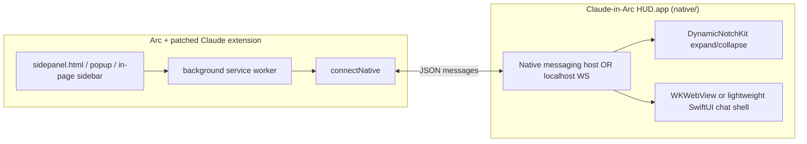

# Dynamic Island / Notch HUD for Claude in Arc

> Research note (June 2026). Evaluates whether [boring.notch](https://github.com/TheBoredTeam/boring.notch) or similar macOS notch overlays can host Claude chat as an alternative to Arc’s missing `chrome.sidePanel`.
>
> **Adoption verdict:** **YES** for a deferred Phase 2 pattern (extension → dedicated native-messaging host → Swift `NSPanel` HUD). **NO** as a v1 replacement — ship **in-page sidebar** first.

---

## Reddit case study: “Building Dynamic Island for macOS in Swift”

**Post:** [r/macapps — Building Dynamic Island for macOS in Swift](https://www.reddit.com/r/macapps/comments/1eihnxb/building_dynamic_island_for_macos_in_swift/) (Aug 2024, u/Modders_Arena)

| Question | Answer |
|----------|--------|
| **True Apple Dynamic Island API?** | **No.** macOS has no public Dynamic Island API. The title is UX/marketing language. |
| **What was actually built?** | [**Boring Notch**](https://github.com/TheBoredTeam/boring.notch) — open-source free alternative to paid notch apps (NotchNook, etc.). Author’s v1: SwiftUI notch UI + hover expand; then system-wide media, weather, battery, AirDrop. |
| **Technical stack** | Custom **`NSPanel`** overlay (borderless, non-activating, high window level), **SwiftUI** content, **`NSScreen.auxiliaryTopLeftArea` / `auxiliaryTopRightArea`** for notch anchoring, **`NSTrackingArea`** or hover for expand/collapse, **menu-bar agent** (`LSUIElement`). No private “Dynamic Island” entitlement. |
| **Relation to claude-in-arc** | Same *windowing pattern* as a future HUD companion; **not** a browser integration — standalone app users install separately. |

Thread comments (“expand items *with* the notch”, hide “Boring Notch” title) confirm a **custom animated panel**, not system chrome.

---

## Problem

Arc does not implement Chrome’s Side Panel API. `claude-in-arc` already ships two **extension-only** mitigations:

| Mode | How | Status |
|------|-----|--------|
| **Popup** (default) | Reusable always-on-top `chrome.windows.create({ type: "popup" })` | Stable since v1.0 |
| **In-page sidebar** | Fixed right column injected into the active tab (`claude-arc-sidebar-host.js` → iframe bridge) | **v1.2.9** — `claude-in-arc install --panel-mode sidebar` |

A **native notch HUD** would be a third surface: macOS overlay at the display notch, visually similar to iOS Dynamic Island or boring.notch, wired to the same patched Claude extension.

---

## What is boring.notch?

| | |
|---|---|
| **Repo** | [TheBoredTeam/boring.notch](https://github.com/TheBoredTeam/boring.notch) (~9.7k ★, Swift) |
| **License** | **GPL-3.0** (not MIT) |
| **Runtime** | macOS 14+ (Sonoma); build docs say macOS 15.6+ / Xcode 26 |
| **Distribution** | DMG, Homebrew cask |
| **Purpose** | Turn the MacBook notch into a live activity strip: music controls, calendar, file shelf, volume/brightness HUD replacement, gestures, multi-display |

It is a **standalone menu-bar app**, not a library or browser integration. Users install and run it separately from Arc.

### Architecture (high level)

```
MenuBarExtra (settings / quit)
        │
        ▼
AppDelegate ──► BoringNotchSkyLightWindow (borderless NSPanel)
        │         • styleMask: .borderless, .nonactivatingPanel, .utilityWindow, .hudWindow
        │         • NSHostingView(rootView: ContentView())
        │         • positioned top-center: screen midX, screen maxY − window height
        │
        ├── BoringViewModel / BoringViewCoordinator (open/closed notch state)
        ├── Managers: Music, Battery, Brightness, Volume, Webcam, …
        ├── BoringNotchXPCHelper (privileged helper for accessibility / system hooks)
        ├── NotchSpaceManager (window layering)
        └── Sparkle updater, Defaults, KeyboardShortcuts
```

**UI stack:** SwiftUI (`ContentView`, `NotchShape`, hover/gesture expand-collapse). **Not** a public SDK — the app *is* the product.

### Extension / plugin API

**None today.** README roadmap lists **“Extension system 🧩”** as **unchecked / future**. There is no documented plugin manifest, XPC surface for third parties, or hook for embedding arbitrary chat UI. Integrating claude-in-arc **through** boring.notch would require upstream cooperation or forking the entire app.

---

## Integration options for claude-in-arc

| Option | Description | Verdict |
|--------|-------------|---------|
| **A. Fork / embed boring.notch** | Vendor their window + SwiftUI notch chrome | **Not recommended.** GPL-3.0 requires derivative works to be GPL; this repo is **MIT**. Copying substantive code into `claude-in-arc` would force a license change or a legally separate GPL app with no code mixing. |
| **B. boring.notch plugin** | Ship Claude as an official extension | **Blocked.** Extension system is roadmap-only; no API. |
| **C. Standalone companion (inspired)** | New MIT app: `NSPanel` / [DynamicNotchKit](https://github.com/MrKai77/DynamicNotchKit) (MIT) + own SwiftUI | **Recommended** for Phase 2 native HUD. Study boring.notch *behavior* (positioning, non-activating panel, multi-screen), implement independently. |
| **D. Native messaging: extension → Swift host** | Patched extension talks to a local host via `chrome.runtime.connectNative` (same pattern as Claude Desktop) | **Recommended transport** inside Option C. Reuses mental model from `claude-in-arc link` / `com.anthropic.claude_browser_extension`. |

**Cannot integrate as a submodule of boring.notch** without GPL implications. **Can** ship a **sibling app** in `native/` that users install alongside the patched extension.

---

## Comparison: boring.notch vs “Reddit Swift” notch apps

The [r/macapps thread](https://www.reddit.com/r/macapps/comments/1eihnxb/building_dynamic_island_for_macos_in_swift/) **is** the boring.notch origin story — not a separate “Reddit Swift” stack. Other community notch tools discussed around Arc / Claude (r/ArcBrowser, Claude Code circles) share the same **custom overlay** pattern but different products:

| | **boring.notch** (Reddit post → OSS) | **Other AI notch apps** (e.g. [MioIsland](https://github.com/MioMioOS/MioIsland), [AI Island](https://github.com/VoidLight00/ai-island), [Claude Island](https://github.com/ahscuml/ping-island), [agent-notch](https://github.com/zorahrel/agent-notch)) |
|---|---|---|
| **Primary job** | System utility (media, HUD, shelf) | **AI session HUD** (status, approvals, jump-to-window) |
| **Claude browser extension** | No | No — mostly **Claude Code CLI** via hooks + Unix socket |
| **Notch library** | Custom (`BoringNotchSkyLightWindow`, `NotchShape`) | Often **[DynamicNotchKit](https://github.com/MrKai77/DynamicNotchKit)** (MIT) |
| **License** | GPL-3.0 | Mixed (e.g. Apache-2.0 for Claude Island) |
| **Fit for claude-in-arc** | Poor (license + no API + wrong product) | **Closer UX reference**, but still CLI-oriented — needs a **browser extension bridge** |

**Takeaway:** The Reddit/Swift path validates **standalone notch HUD + local IPC**, not “install boring.notch and plug in.” For Arc chat, bridge the **patched MV3 extension** (page context, sidepanel UI) rather than Claude Code hooks.

---

## Legal / license check

| Project | License | Use in MIT `claude-in-arc` |
|---------|---------|------------------------------|
| **boring.notch** | GPL-3.0 | Do **not** copy source into this repo. Optional: separate GPL fork maintained outside this monorepo (high maintenance, not aligned with project license). |
| **DynamicNotchKit** | MIT | Safe to depend on in `native/` companion app. |
| **NotchDrop** (boring.notch credits) | Check per-project | Shelf idea only; don’t copy without license review. |
| **claude-in-arc** | MIT | Native companion should stay MIT and live in `native/` as optional install. |

**Patterns** (borderless `NSPanel`, top-center anchoring, `safeAreaInsets` for notch size) are not copyrightable; **reimplement** rather than paste from boring.notch.

---

## Recommended architecture — Phase 2 native HUD

Phase 1 remains the **Chromium extension** (`agent/` + patcher). Phase 2 adds an **optional macOS companion**:



**Milestones (see `native/README.md`):**

1. **M0** — Schema + stub host (`native/schemas/hud-message-v1.json`)
2. **M1** — Menu-bar app, collapsed notch pill, no extension wire-up
3. **M2** — `connectNative` host registered; extension sends `toggle` / `page-context` events
4. **M3** — Expanded notch embeds chat (WebView → extension `sidepanel.html` or shared `agent/` UI build)
5. **M4** — Polish: multi-display, non-activating panel, signing / notarization docs

**Out of scope for Phase 2:** Replacing boring.notch system features; GPL code reuse; App Store requirement (start with load-unpacked / `.dmg`).

---

## What to do today (vs waiting for native)

| Goal | Action now |
|------|------------|
| **Best in-Arc chat UX without native code** | `claude-in-arc install --panel-mode sidebar` (v1.2.9). In-page right column on normal sites; falls back to popup on `chrome://` / restricted URLs. Toggle via extension context menu. |
| **Popup still fine** | Default `popup` mode — proven, no tab injection. |
| **Notch / Dynamic Island** | **Wait for Phase 2** `native/` companion; boring.notch is not a shortcut. Optionally install boring.notch for personal system utility — it will **not** show Claude Arc chat. |
| **Experiment with notch UI** | `cd native/ClaudeInArcHUD && swift build` (scaffold); read DynamicNotchKit docs. |

**Recommendation:** Ship and dogfood **in-page sidebar** now; parallel-track **MIT companion + native messaging** for notch die-hards. Do not fork boring.notch.

---

## References

- [r/macapps — Building Dynamic Island for macOS in Swift](https://www.reddit.com/r/macapps/comments/1eihnxb/building_dynamic_island_for_macos_in_swift/) — boring.notch build-in-public origin (custom overlay, not Apple API)
- boring.notch: https://github.com/TheBoredTeam/boring.notch
- [NotchKit](https://github.com/aishwaryaashok14/notch-kit) — `NSPanel` + notch detection reference implementation
- DynamicNotchKit (MIT): https://github.com/MrKai77/DynamicNotchKit
- claude-in-arc sidebar assets: `claude_in_arc/assets/claude-arc-sidebar-host.js`, `claude-arc-sidebar-bridge.html`
- Native messaging (existing): `claude-in-arc link`, `com.anthropic.claude_browser_extension`
- Phase 2 plan scaffold: `native/README.md`
- Native targets: `ClaudeInArcHUD` (menu bar + `NSPanel`), `ClaudeInArcHUDHost` (native-messaging stub), `ClaudeInArcHUDCore` (`HUDPanelController` notch positioning), `native/ClaudeInArcHUD/`
