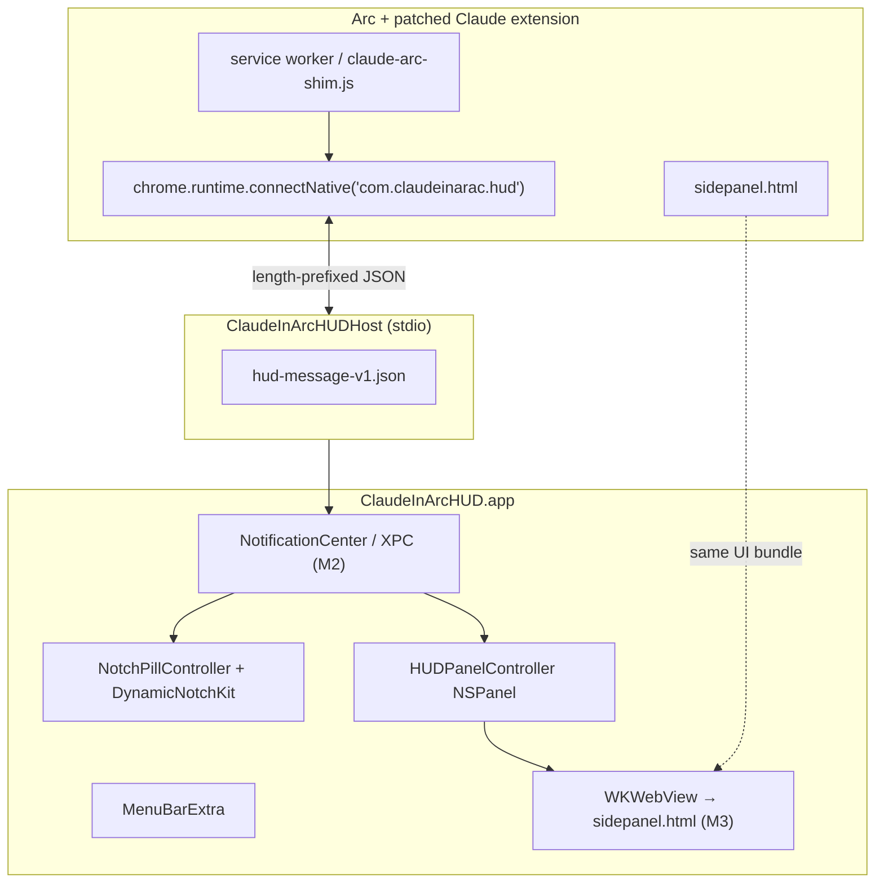

# Notch HUD integration — Arc + Claude (Phase 2 design)

Research note (June 2026). Proposes an **integrated** macOS companion where the user keeps browsing in Arc while Claude lives in a Dynamic Island–style notch overlay, wired to the patched extension via native messaging.

Cross-links: [arc-side-panel-alternatives.md](arc-side-panel-alternatives.md) (ranked options), [DYNAMIC_ISLAND.md](../docs/DYNAMIC_ISLAND.md) (boring.notch / license analysis), [native/README.md](../native/README.md) (scaffold status).

---

## Executive summary

| Question | Answer |
|----------|--------|
| Can notch feel more integrated than split popup? | **Yes, perceptually** — borderless pill at the display notch reads as “system chrome,” not a second app window. Chat is still outside Arc’s frame. |
| Recommended stack | **MIT** `native/ClaudeInArcHUD` + [DynamicNotchKit](https://github.com/MrKai77/DynamicNotchKit) + `chrome.runtime.connectNative` |
| Fork boring.notch? | **No** — GPL-3.0, no plugin API |
| Ship before sidebar/split polish? | **No** — extension-only modes remain v1; HUD is optional Phase 2 |

---

## Problem restated

Arc cannot host `chrome.sidePanel` or extension iframes in-page. Today `claude-in-arc` mitigates with:

1. **Split mode** — page margin + docked `type: "popup"` (separate OS window with title bar)
2. **Popup mode** — floating narrow window
3. **In-page sidebar** — Chrome/Brave only (Arc blocks extension iframes)

Users who stay on Arc for browsing want Claude to feel **attached** to the machine, not “another window fighting the window manager.” A notch HUD targets that feeling without requiring Arc to change.

---

## Community reference apps (patterns only)

These validate the **standalone overlay + local IPC** pattern. None bridge the **browser extension** today — that gap is what `claude-in-arc` fills.

### DynamicNotchKit (MIT) — recommended library

| API | Role |
|-----|------|
| `DynamicNotch(style: .auto)` | Custom SwiftUI in notch; `.floating` on non-notch Macs |
| `await notch.compact(on:)` | Collapsed pill (v1.0+) |
| `await notch.expand(on:)` | Expanded panel |
| `await notch.hide()` | Dismiss |
| `NSScreen.hasNotch`, `notchFrame` | Geometry helpers |

No Apple Dynamic Island API exists on macOS — all products use custom `NSPanel` / library windows.

### boring.notch (GPL-3.0) — study only

Architecture (reimplement, do not copy):

```
MenuBarExtra → AppDelegate → BoringNotchSkyLightWindow (borderless NSPanel)
  • styleMask: .borderless, .nonactivatingPanel, .utilityWindow, .hudWindow
  • NSHostingView(SwiftUI)
  • top-center via auxiliaryTopLeftArea / auxiliaryTopRightArea
  • XPC helper for accessibility hooks
```

**No extension API.** Roadmap lists “Extension system” as unchecked.

### agent-notch (MIT)

- **Job:** Multi-agent coding session HUD (Claude Code, Cursor, Aider, …)
- **Bridge:** HTTP + SSE to `localhost:3340` (Jarvis router); future `agent-conductor watch` subprocess
- **Notch:** DynamicNotchKit + hover expand
- **Lesson:** Event bus (`NotchEventBus`) decouples UI from transport; we mirror with native messaging instead of HTTP

### Ping Island / Claude Island (Apache-2.0)

- **Job:** Approve tool calls, answer prompts, jump to terminal/IDE
- **Bridge:** Claude Code **hooks** → embedded bridge launcher → `SessionStore`
- **Notch:** Dynamic Island–style expand on attention events
- **Lesson:** Collapsed-until-attention UX; focus routing to source window — relevant for “return to Arc tab” in M4

### MioIsland

Same category as above — system utility + AI status; CLI/hook oriented, not Chromium extension.

---

## Recommended architecture



### Transport: native messaging (not a second HTTP server)

Reuse the mental model from `claude-in-arc link` / `com.anthropic.claude_browser_extension`:

1. Chrome spawns `ClaudeInArcHUDHost` on `connectNative`
2. **4-byte LE length** + UTF-8 JSON per message ([Chrome docs](https://developer.chrome.com/docs/extensions/develop/concepts/native-messaging))
3. Host forwards to menu-bar app via `DistributedNotificationCenter` or lightweight Unix socket (M2)
4. Separate manifest `com.claudeinarac.hud` — does not collide with Claude Desktop host

Schema: `native/schemas/hud-message-v1.json`

| ext → host | host → ext |
|------------|------------|
| `ping` | `pong` |
| `toggle_hud` | `hud_expanded` / `hud_collapsed` |
| `page_context` (tabId, url, title) | `request_page_context` |
| `sidebar_state` (visible) | `hud_ready` |

### Chat surface (M3 decision)

| Option | Pros | Cons |
|--------|------|------|
| **A. WKWebView → `sidepanel.html?tabId=`** | Full Anthropic UI + page context path already works | Must load `chrome-extension://` URL — needs custom scheme handler or localhost relay |
| **B. Lightweight SwiftUI shell** | Smaller, native feel | Rebuilds chat UX; high effort |
| **C. Relay via extension** | WebView loads `http://127.0.0.1:PORT/...` proxied by SW | Extra moving parts |

**Recommendation:** Start **A** with extension-hosted relay page (`claude-arc-hud-bridge.html`) that mirrors sidebar bridge pattern; fall back to **split popup** if WebView cannot load extension origin.

### Panel modes coexistence

| Mode | When |
|------|------|
| `split` (default Arc) | User wants page shrink + docked popup |
| `hud` (new, opt-in) | User installs HUD; extension sends events to host; **no** split popup when HUD owns chat |
| `popup` | Minimal / fallback |

Add `claude-in-arc config --panel-mode hud` in M2 (not in this scaffold).

---

## UX flows

### Collapsed pill → expand chat

1. User browses in Arc; pill shows **“Claude”** or page title snippet
2. Hover or click pill → `expand()` — DynamicNotchKit animation
3. Expanded area shows chat (WebView M3) or placeholder panel (M1)
4. Collapse returns to compact pill; Arc tab unchanged

### ⌘E / toolbar icon

| Phase | Behavior |
|-------|----------|
| M1 | ⌘E still opens split/popup (unchanged) |
| M2 | If HUD installed + `--panel-mode hud`: ⌘E sends `toggle_hud` over native messaging |
| M3 | HUD expand + focus WebView input |

### Page context sync

On tab activation / navigation (existing shim hooks):

```json
{"v":1,"dir":"ext_to_host","type":"page_context","tabId":42,"url":"https://…","title":"…"}
```

HUD pill subtitle updates; expanded chat receives same `tabId` as split mode.

### Multi-monitor / non-notch Macs

| Case | Behavior |
|------|----------|
| **Notched MacBook** | `DynamicNotch(style: .auto)` → `.notch` on built-in display |
| **External monitor** | Pill on screen with keyboard focus (Arc window's `NSScreen` via host); follow Arc window across displays |
| **No notch (Mac Studio, Intel)** | DynamicNotchKit `.floating` top-center pill — same UX, different chrome |
| **Menu bar on external display** | Use `NSScreen.screens` + Arc window bounds; avoid hard-coding `screens[0]` |

`HUDPanelController.positionBelowMenuBar` already centers using `auxiliaryTopLeftArea` / `auxiliaryTopRightArea`.

---

## Integration vs split popup — honest comparison

| Dimension | Split popup | Notch HUD |
|-----------|-------------|-----------|
| **OS window chrome** | Title bar, separate window in Cmd+Tab | Borderless / pill — often `LSUIElement` |
| **Spatial coupling** | Docked beside page (can drift) | Anchored to menu bar / notch |
| **Arc iframe policy** | Unaffected | Unaffected |
| **Install burden** | Extension only | Extension + native app + manifest |
| **“Inside Arc”** | No | No — but *feels* more ambient |
| **Page margin** | Yes (split) | No — full-width page |

**Verdict:** Notch is the best **integrated-feeling** option for Arc loyalists who accept a sibling native install. It does not beat Chrome **in-page sidebar** for true single-window UX.

---

## Milestones

| Milestone | Scope | Estimate | Status |
|-----------|-------|----------|--------|
| **M0** | Schema, SPM scaffold, `hud-message-v1.json`, CLI `claude-in-arc hud build` | 1–2 days | **Done (scaffold)** |
| **M1** | DynamicNotchKit pill + menu bar app; placeholder expanded `NSPanel` | 3–5 days | **Done** — `NotchPillController`, `HUDPanelController` |
| **M2** | `connectNative` in shim; host ↔ app IPC; `hud install`; `panel-mode hud` | 1–2 weeks | **Done** — native messaging + `panel-mode hud` |
| **M3** | WKWebView chat via bridge page; page context; ⌘E routes to HUD | 2–3 weeks | **Done (v1.2.26)** — `claude-arc-hud-bridge.html`, `claude-in-arc-ext://` scheme + chrome polyfill |
| **M4** | Multi-display, signing/notarization, `doctor` HUD checks, polish | 1–2 weeks | — |

**Total Phase 2:** ~6–10 weeks part-time after M1 dogfood.

---

## What you can try today

```bash
# From repo root (macOS 13+, Xcode CLI tools)
claude-in-arc hud build      # swift build in native/ClaudeInArcHUD
claude-in-arc hud open       # menu-bar app; collapsed notch pill on launch
claude-in-arc hud install    # register com.claudeinarac.hud in Arc NativeMessagingHosts

# Manual
cd native/ClaudeInArcHUD && swift build
.build/debug/ClaudeInArcHUD
```

**Expect:** Collapsed DynamicNotchKit pill + menu-bar toggle; ⌘E in `panel-mode hud` expands a floating panel with real Claude chat (WKWebView + extension bridge). Requires `claude-in-arc install`, `hud install`, and extension reload.

### M3 reinstall / test steps

```bash
claude-in-arc install --panel-mode hud   # or: claude-in-arc config --panel-mode hud && claude-in-arc install
claude-in-arc hud build
claude-in-arc hud install
claude-in-arc hud open                   # menu-bar app + collapsed pill
# arc://extensions → Reload Claude in Arc
# Browse in Arc, press ⌘E — HUD panel expands with Claude chat + page context (tabId)
```

---

## Troubleshooting (blank HUD panel)

### Symptoms

- ⌘E does nothing, or a floating panel opens but stays **empty / dark**
- Notch pill may expand but chat panel is blank

### Quick checklist

```bash
claude-in-arc install --panel-mode hud   # rebuild extension with HUD assets + mode
claude-in-arc hud build
claude-in-arc hud install                # registers host + launches menu-bar app (v1.2.26+)
# arc://extensions → Reload Claude in Arc
```

Confirm **panel mode** is `hud`: extension service worker console should log `[claude-in-arc] hud connected native host com.claudeinarac.hud` on first ⌘E.

### Console.app filters

| Process / subsystem | What to look for |
|---------------------|------------------|
| `ClaudeInArcHUD` | `extension root=…`, `loadBridge url=…`, `scheme 200 path=sidepanel.html` |
| `ClaudeInArcHUD` | `scheme 404` → extension not built/installed or wrong path |
| `ClaudeInArcHUD` | `chrome polyfill missing` → run `claude-in-arc install` |
| `ClaudeInArcHUDHost` | `launched ClaudeInArcHUD` on first toggle (auto-start) |
| `ClaudeInArcHUDHost` | `ClaudeInArcHUD not found` → run `claude-in-arc hud build` |

### arc://extensions service worker

Open **Inspect views: service worker** for Claude in Arc. On ⌘E you should see:

```
[claude-in-arc] hud openPanelInHud tabId=… reason=commands.onCommand
[claude-in-arc] hud postMessage type=toggle_hud
[claude-in-arc] hud postMessage type=page_context
```

If you see `connectNative unavailable` or `HUD postMessage failed`, run `claude-in-arc hud install` and Reload.

If `toggle_hud` posts but no panel: ensure `ClaudeInArcHUD` is running (menu-bar **Claude** icon). v1.2.26+ auto-launches it from the native host.

### Common root causes (fixed in v1.2.26–v1.2.27)

1. **Menu-bar app not running** — host only spoke to Chrome; toggle notifications were dropped. Host now auto-launches `ClaudeInArcHUD` sibling binary (retries notification 4×).
2. **`hudChrome` WKScriptMessageHandler registered after `WKWebView` init** — chrome polyfill could not proxy `storage.*` / `runtime.sendMessage`; sidepanel rendered blank. Handler is now registered on `WKWebViewConfiguration` before WebView creation.
3. **Extension build missing bridge assets** — `ExtensionRootResolver` requires `claude-arc-hud-bridge.html` in the patched build directory. Re-run `claude-in-arc install --panel-mode hud`.
4. **Expanded notch mistaken for chat panel** — v1.2.27 keeps the notch compact on ⌘E; chat opens in the floating `HUDPanelController` panel (higher window level, key + focus).
5. **Full shim running inside HUD sidepanel iframe** — v1.2.27 bails in `claude-in-arc-ext://` context so only the native chrome polyfill is active.
6. **Store copy loaded** — panel shows an on-screen error; run `claude-in-arc doctor` and remove the Store Claude entry on arc://extensions.

---

## What to build next

1. **M4:** Multi-display Arc window follow; `doctor` section for HUD manifest + binary path; ad-hoc `codesign` docs
2. **M4:** Expand chrome polyfill coverage if upstream sidepanel adds new APIs
3. **M4:** Optional WKWebView in notch expanded view (chat currently in floating panel)

---

## Security notes

- Native messaging host runs as user; validate JSON schema; cap message size (1 MiB, matching host stub)
- `allowed_origins` must include only official extension id `fcoeoabgfenejglbffodgkkbkcdhcgfn`
- Do not expose arbitrary URL loading in WebView without extension origin checks

---

## References

- [DynamicNotchKit](https://github.com/MrKai77/DynamicNotchKit) (MIT)
- [agent-notch](https://github.com/zorahrel/agent-notch) — HTTP/SSE session HUD
- [Ping Island](https://github.com/ahscuml/ping-island) — hooks + notch approvals
- [boring.notch](https://github.com/TheBoredTeam/boring.notch) — GPL reference (patterns only)
- Chrome native messaging: https://developer.chrome.com/docs/extensions/develop/concepts/native-messaging
- claude-in-arc sidebar bridge: `claude_in_arc/assets/claude-arc-sidebar-bridge.html`
