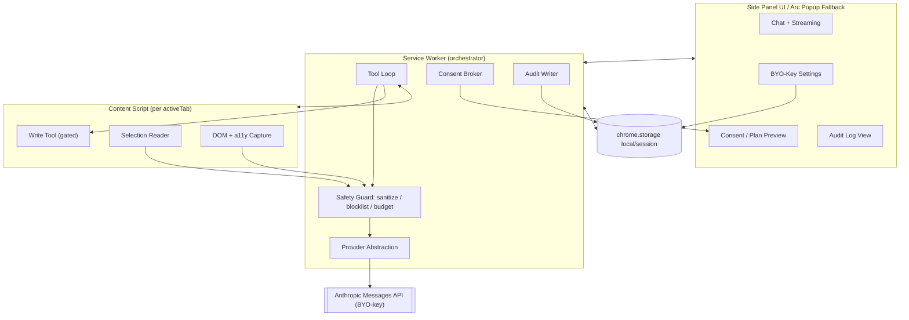

# Phase 1 — Scope & Implementation Plan: Cross‑Browser Claude Agent

> **What this is.** The concrete Phase‑1 build plan for the 0→1 agent, derived from and consistent with `zero-to-one-cross-browser-agent.md`. **Plan only — no implementation here.**
>
> **Inherited verdict (do not re‑litigate):** *Conditional GO — Chromium‑first, BYO‑key, read‑first/copilot, trust + safety as the moat.* Firefox/Safari are demand‑gated later phases. "Cross‑browser" in Phase 1 = **one Chromium build that also runs in Arc**, reusing the patcher's `chrome.sidePanel`→popup fallback. CDP/`chrome.debugger` and blanket `<all_urls>` are **out** of Phase 1.
>
> **Stance:** senior engineer‑architect + pragmatic founder. Ship the smallest thing that is *trustworthy*, not the most capable. The safety layer is the product, not a feature.

---

## 1. Product Definition

**Phase‑1 user value (one line):** *A read‑first Claude copilot in a side panel for any Chromium browser (incl. Arc): read the current page / your selection / your open tabs, then summarize, answer, or draft — using your own API key, with you in control of any action that changes anything.*

**Primary read‑first jobs (the value):**

| Job | Input the agent reads | Output |
|---|---|---|
| Summarize | Current page (main content + a11y tree) | TL;DR + key points |
| Answer about page | Page content + user question | Grounded answer w/ "based on this page" |
| Explain selection | User‑highlighted selection only | Explanation / definition |
| Draft from context | Page/selection + user intent | Drafted text in panel (copy‑out, not auto‑inserted) |
| Compare/synthesize tabs | User‑selected open tabs (titles + content) | Cross‑tab summary / comparison |

**Write actions:** Phase 1 ships **at most one** consent‑gated, reversible write tool — `fill_text_into_focused_field` (insert drafted text into the field the user explicitly focused) — behind an explicit per‑use confirmation. Everything irreversible/sensitive is **out**. If M3 reveals injection risk we can't bound cheaply, ship Phase 1 read‑only and defer the write tool to Phase 2 (this is an accepted gate, not a failure).

### In / Out of scope

| In scope (Phase 1) | Out of scope (Phase 1 → later phase) |
|---|---|
| Chromium only (Chrome/Edge/Brave/Arc/Vivaldi/Opera) | Firefox (P2), Safari (P3) |
| Side panel UI w/ Arc popup fallback | Native side panel parity on Arc |
| Read page / selection / chosen tabs | Autonomous multi‑step navigation, autopilot |
| BYO‑key (Anthropic first) | Hosted proxy / billing / our servers (P2 Pro) |
| Streaming chat + tool loop (read tools) | CDP / `chrome.debugger`, network interception |
| 1 consent‑gated reversible write tool (optional) | Clicking, form submit, downloads, payments, auth, email send |
| `activeTab` + optional per‑host perms | Blanket `<all_urls>` at install |
| Sensitive‑domain blocklist, audit log | Per‑site allowlist management UI (P2 Teams) |
| Multi‑provider *abstraction* (Anthropic impl only) | Shipping OpenAI/Gemini/local adapters |

### "Phase 1 done" success criteria

| # | Criterion |
|---|---|
| S1 | Loads and runs in **both** stock Chrome and Arc (side panel in Chrome, popup fallback in Arc) from a single build |
| S2 | User completes BYO‑key onboarding and gets a streamed summary of the active page |
| S3 | Selection‑scoped and multi‑tab (user‑selected) reads work |
| S4 | Page content is structurally untrusted; documented injection test corpus passes the "must‑not‑act" bar (see §3) |
| S5 | Any write action requires a distinct confirmation UI; sensitive domains blocked by default; every action appears in an auditable log |
| S6 | No telemetry by default; key never synced; manifest has no `<all_urls>`/`debugger` |
| S7 | OSS core, published threat model + privacy doc; CWS listing assets drafted |

---

## 2. Architecture

### MV3 structure

| Component | Role | Notes |
|---|---|---|
| Service worker (`background`) | Tool‑loop orchestrator, provider calls, consent broker, audit writer | Ephemeral; persist state in `chrome.storage.session` (mirrors shim pattern) |
| Side panel UI (`sidepanel.html`) | Chat, plan/consent prompts, action log, settings | Primary surface on real Chromium |
| Popup fallback (Arc) | Same UI via `chrome.windows.create({type:"popup"})` | Reuse patcher's `sidePanel`→popup polyfill (see below) |
| Content script | Page‑context capture (DOM + a11y), selection, optional single write tool | Injected via `activeTab`/`scripting`, just‑in‑time; **never** receives model instructions |
| Offscreen doc | **Not needed in Phase 1** | No audio/DOM‑parsing‑off‑thread need yet; revisit if heavy sanitization moves off the SW |

### Arc compatibility from day one (reuse the patcher approach)

Detect `chrome.sidePanel` at startup. If present → use the real Side Panel API. If absent (Arc, some Vivaldi) → fall back to a single reusable always‑on‑top popup window keyed by tab id, persisting the window id in `chrome.storage.session` and re‑targeting on tab change. This is exactly the proven logic in `claude_in_arc/assets/claude-arc-shim.js` (`openOrFocusPanel`, `PANEL_WINDOW_KEY`/`PANEL_TAB_KEY`, `onRemoved` cleanup). **Decision: ship side panel as primary, popup as the capability‑detected fallback** — one code path, no Arc‑specific build.

### The observe→plan→consent→act loop

```
observe ─ capture page context (DOM text + a11y tree, bounded) + selection/tabs
   │       page content tagged as UNTRUSTED DATA
   ▼
plan ──── Claude tool‑calling: read tools auto‑run; any write tool returns a PROPOSAL
   │
   ▼
consent ─ read tools: no gate. write tool: distinct confirm UI (what/where/why) + blocklist check
   │
   ▼
act ───── execute approved tool in content script → write result back as untrusted data
   │
   ▼
audit ─── append {ts, tool, args, decision, outcome} to local audit log → re‑observe / await user
```

**Context capture + bounding rules:** main‑content extraction (Readability‑style) + a11y roles/names; strip scripts, hidden/off‑screen/`aria-hidden` nodes (injection hygiene); hard caps on chars/nodes per turn; selection mode sends only the selection; multi‑tab requires explicit user tab‑pick (no silent tab reads). Token/size budget enforced before any provider call.

### Component diagram



---

## 3. Safety Layer (the hard 80%)

**Architectural rule:** *page/tab/selection content is untrusted DATA and is never placed in the instruction channel.* System + operator instructions and page data travel in structurally separate slots; the model is told page content may contain adversarial instructions to be ignored.

### Threat model (Phase‑1 subset; full list in audit §B.1)

| Threat | Phase‑1 vector | Phase‑1 mitigation | Residual |
|---|---|---|---|
| Prompt injection | Hidden/visible page text instructs agent to act/exfiltrate | Data/instruction separation; strip hidden/off‑screen nodes; read‑first (no auto write); write tool can't navigate/submit; injection test corpus gate | Non‑zero (accepted; "safe enough for scope") |
| Data exfiltration | Model asked to send data to attacker URL | No navigate/network/click tools in P1; only output is panel text + 1 local field write | Low |
| Over‑broad perms | `<all_urls>` install | `activeTab` + optional per‑host, JIT‑requested | Low |
| Sensitive‑site exposure | Agent reads banking/email/health/gov | Default blocklist; agent disabled on match unless user overrides per‑site | Low |
| Key leakage | Key in `chrome.storage`, logs | `storage.local` (never `sync`); no key in logs/audit; redaction; documented limits | Medium (inherent to BYO‑key in ext) |
| Supply chain | Compromised dep/build | Pinned deps, minimal third‑party, reproducible build, signed release | Medium |

### Consent UX

- **Read = no gate** (the read‑first promise). **Write = distinct confirmation** showing exact text + target field + page origin; never bundled into chat.
- **Copilot is the only mode in Phase 1** (no autopilot). Persistent "agent active" indicator; one‑click stop.
- Blocklist hit → agent surfaces a clear "this site is blocked for safety" state, requires explicit per‑site override.

### Least privilege (manifest posture)

| Permission | Phase 1? | Justification |
|---|---|---|
| `activeTab` | ✅ | Read current tab on user gesture; minimal blast radius |
| `scripting` | ✅ | Inject capture/write content script JIT |
| `storage` | ✅ | Key + settings + audit (local/session) |
| `sidePanel` | ✅ | Primary UI (graceful absence on Arc) |
| `tabs` | ⚠️ minimal | Needed for multi‑tab pick + popup retargeting; request narrowly |
| optional host perms | ✅ (optional) | Per‑host read, requested just‑in‑time |
| `<all_urls>` | ❌ | Blast radius = entire browsing life; store‑review red flag |
| `chrome.debugger`/CDP | ❌ | Persistent debug banner, review hostility, not needed for read‑first |

### Audit log & privacy / data flow

- **Audit log:** append‑only, local, user‑viewable/clearable: `{ts, tool, args(redacted), origin, decision, outcome}`.
- **Leaves device:** only (a) prompt + bounded page/selection/tab text → **user's own** Anthropic endpoint over TLS via their key; (b) nothing else. **No** telemetry, **no** analytics, **no** our‑server hop in Phase 1.
- **Stays on device:** API key, settings, audit log.

### Minimum bar to ship "safe enough"

| Gate | Requirement |
|---|---|
| Injection | Curated corpus (visible + hidden‑node injection attempts) → agent performs **zero** unconsented actions and does not leak key/cookies in any case |
| Consent | No write path exists without a distinct confirm UI; verified by test |
| Perms | No `<all_urls>`/`debugger`; optional host perms requested JIT |
| Blocklist | Default sensitive‑domain list active on first run |
| Privacy | Verified: nothing leaves device except user→Anthropic; no telemetry |
| Transparency | Public threat model + privacy doc; OSS core; visible audit log |

---

## 4. BYO‑Key UX

| Aspect | Phase‑1 decision |
|---|---|
| Onboarding | First‑run panel: paste Anthropic key → validate with a cheap test call → store; link to "where to get a key" + privacy doc; no account, no signup |
| Storage | `chrome.storage.local` only (**never** `sync`); documented as "not a hardware secret store"; optional session‑only mode (key not persisted); redact in all logs |
| Provider abstraction | `Provider` interface (`stream(messages, tools)`, `validateKey()`); **Anthropic impl only** in P1, structured so OpenAI/Gemini/local drop in (P2) |
| Streaming | Anthropic Messages API streaming → token‑by‑token render in panel; abortable |
| Errors/limits | Map 401/403 (bad key), 429 (rate/limit), 529/5xx (overloaded), network → clear, actionable panel messages w/ retry/backoff; never silently fail; surface usage caveats |

---

## 5. Tech Stack & Repo Decision

**Decision: new top‑level package inside this monorepo — `agent/`.** Rationale: (1) the patcher is the audience/funnel and trust brand (per STRATEGY.md); colocating lets README cross‑sell and share the security/brand narrative; (2) shared docs (`docs/SECURITY.md`, threat model) and the proven `sidePanel`→popup logic live here already; (3) clean language boundary (Python CLI vs TS extension) avoids tooling collision; (4) one repo = one trust surface, one issue tracker, one canonical link. Revisit a split only if the agent's contributor base or release cadence diverges sharply (P2+).

| Layer | Choice | Why |
|---|---|---|
| Language | TypeScript | Type safety for tool schemas + provider contracts |
| UI | Lightweight (Preact/Svelte or vanilla + minimal) | Side panel is small; avoid heavy framework weight/CSP friction |
| Build | Vite + `@crxjs` (or esbuild) | Fast MV3 build, HMR for dev |
| Content extraction | Readability‑style + a11y walk | Bounded, sanitized capture |
| Lint/format | ESLint + Prettier | Standard |
| Tests | Vitest (unit) + Playwright (ext e2e on Chromium) | Cover loop + injection corpus + e2e load |

### Directory layout

```
agent/
  manifest.json
  src/
    background/        # service worker: loop, broker, audit, provider calls
    sidepanel/         # UI (chat, consent, log, settings)
    content/           # capture + selection + gated write tool
    lib/
      safety/          # sanitize, blocklist, budget, instruction/data separation
      providers/       # Provider interface + anthropic.ts
      sidepanel-fallback.ts   # ported chrome.sidePanel→popup shim
    types/             # tool schemas, messages
  tests/
    unit/
    injection-corpus/  # adversarial pages + expected "no-act" outcomes
    e2e/               # Playwright: load in Chrome; smoke in Arc (manual/CI note)
  README.md
```

### Test strategy for the safety layer (the part that matters)

| Layer | Test |
|---|---|
| Instruction/data separation | Unit: assert page content never enters instruction slot; sanitizer strips hidden/`aria-hidden`/off‑screen |
| Injection corpus | Fixture pages with visible + hidden "ignore instructions / exfiltrate" payloads → assert **zero** unconsented tool calls, no key/cookie leak |
| Consent | Unit/e2e: every write path blocked without confirm event |
| Blocklist | Unit: sample sensitive domains → agent disabled state |
| Budget | Unit: oversized page truncated/capped before provider call |
| Load/compat | Playwright e2e load in Chrome; documented manual Arc smoke (popup fallback) |

---

## 6. Build Backlog (M1–M6)

Each milestone is individually shippable and gated. Effort is rough (senior, focused).

| M | Goal | Key deliverables | Effort | Acceptance check |
|---|---|---|---|---|
| **M1** | Scaffold + manifest + side panel loads in Arc & Chrome | `agent/` package, MV3 manifest (least‑priv), build tooling, side panel shell, ported `sidePanel`→popup fallback | ~2–3 d | Loads unpacked in **both** Chrome (side panel) and Arc (popup) from one build; empty panel renders; no `<all_urls>`/`debugger` |
| **M2** | Read page → summarize via BYO‑key | Key onboarding+validate+store; content capture (DOM+a11y, bounded, sanitized); Anthropic provider w/ streaming; tool loop w/ `read_page` | ~4–6 d | User pastes key → gets streamed summary of active page; page content in data slot only |
| **M3** | Consent‑gated single action (optional write) | Consent broker + distinct confirm UI; `fill_text_into_focused_field`; audit log write | ~3–4 d | Write only fires after explicit confirm; logged; **or** decide read‑only and defer (gate G3) |
| **M4** | Multi‑tab read + selection | Selection mode; user tab‑picker; cross‑tab synthesis; per‑source budget | ~3–4 d | Selection‑scoped + user‑selected multi‑tab summary works within budget |
| **M5** | Safety hardening + audit log | Injection corpus + tests; sensitive‑domain blocklist; sanitizer hardening; audit log viewer; error/limit handling | ~5–7 d | Min‑bar table (§3) passes; corpus → zero unconsented acts; blocklist active |
| **M6** | Store‑listing prep | Privacy doc, threat model, CWS assets/disclosures, README cross‑sell from patcher, signed build | ~2–3 d | Listing draft complete; perms justified; OSS + threat model published |

---

## 7. Risks & Gates

| Risk | Phase‑1 posture |
|---|---|
| **Web Store policy** (broad perms / "AI controls browser") | Least‑privilege manifest (no `<all_urls>`/`debugger`), optional JIT host perms, no remote code, explicit disclosures + privacy doc; keep load‑unpacked/self‑host path (patcher already normalizes this) |
| **Anthropic API ToS** | BYO‑key default (user is the customer), multi‑provider abstraction, non‑abusive, no "unlimited Claude" marketing; re‑read commercial/usage terms before M6 |
| **First‑party encroachment** | Stay where they're slow (Arc/Chromium variants, BYO‑key, open/trusted); treat window as finite, keep investment proportional |
| **Injection / liability** | Read‑first + copilot‑only + blocklist + no irreversible tools; ship read‑only if write tool can't be bounded |

### Go / No‑Go gates between milestones

| Gate | Between | Proceed only if |
|---|---|---|
| G1 | M1→M2 | Single build verified in Chrome **and** Arc |
| G2 | M2→M3 | Read+summarize trustworthy; data/instruction separation holding |
| G3 | M3→M4 | Write tool passes consent+injection bar — **else ship read‑only**, skip write, continue |
| G4 | M4→M5 | Multi‑source within budget; no perf/leak regressions |
| G5 | M5→M6 | Min‑bar safety table (§3) fully green |
| G6 | M6→ship | Perms justifiable for CWS; threat model + privacy public; OSS core live |

---

## M1 — Defined for direct implementation

**Goal:** A loadable MV3 extension scaffold whose side panel UI opens in **both** stock Chrome (native side panel) and **Arc** (popup fallback) from one build, with a least‑privilege manifest. No model calls, no page reads yet — just the shell + the proven Arc‑compat path.

**Scope (in):**
1. Create `agent/` package: `manifest.json`, Vite+`@crxjs` (or esbuild) build, ESLint/Prettier, `tsconfig`.
2. `manifest.json` (MV3): `name`, `version`, `action` (opens panel), `side_panel.default_path = sidepanel.html`, background service worker (module). **Permissions:** `activeTab`, `scripting`, `storage`, `sidePanel`. **No** `<all_urls>`, **no** `tabs` host perms, **no** `debugger`. `minimum_chrome_version` set.
3. Side panel shell (`src/sidepanel/`): renders a static "Claude Agent — Phase 1" panel with a placeholder chat area and a disabled input (no logic yet).
4. Port `claude_in_arc/assets/claude-arc-shim.js` → `src/lib/sidepanel-fallback.ts`: capability‑detect `chrome.sidePanel`; if absent, open/focus a single reusable popup window keyed by tab id, persisting `panelWindowId`/`panelTabId` in `chrome.storage.session`, with `windows.onRemoved` cleanup (1:1 with existing shim logic).
5. Service worker wires `action.onClicked` → if `chrome.sidePanel` present, open side panel for the tab; else call the fallback `openOrFocusPanel`.
6. Vitest setup with one passing unit test on the fallback's path/window‑id logic.

**Scope (out of M1):** any Anthropic/provider code, content scripts, page capture, consent UI, audit log, write tools.

**Deliverables:** `agent/` package builds to an unpacked extension; loads in Chrome and Arc; clicking the toolbar action opens the panel (side panel in Chrome, popup in Arc).

**Acceptance checks:**
- [ ] `npm run build` (in `agent/`) produces a loadable unpacked MV3 build.
- [ ] Load‑unpacked in **Chrome**: toolbar action opens the panel as a native side panel showing the shell.
- [ ] Load‑unpacked in **Arc**: same action opens the panel as a popup window (fallback), re‑focuses (not duplicates) on repeat clicks, and clears state on close.
- [ ] `manifest.json` contains **no** `<all_urls>`, `debugger`, or broad host permissions.
- [ ] `npm test` passes the fallback unit test.
- [ ] No code outside `agent/` is modified.

**First commands (for the implementer):**
```bash
mkdir -p agent && cd agent
npm init -y
npm i -D vite @crxjs/vite-plugin typescript vitest eslint prettier
# then author manifest.json + src/ per the layout in §5
```
